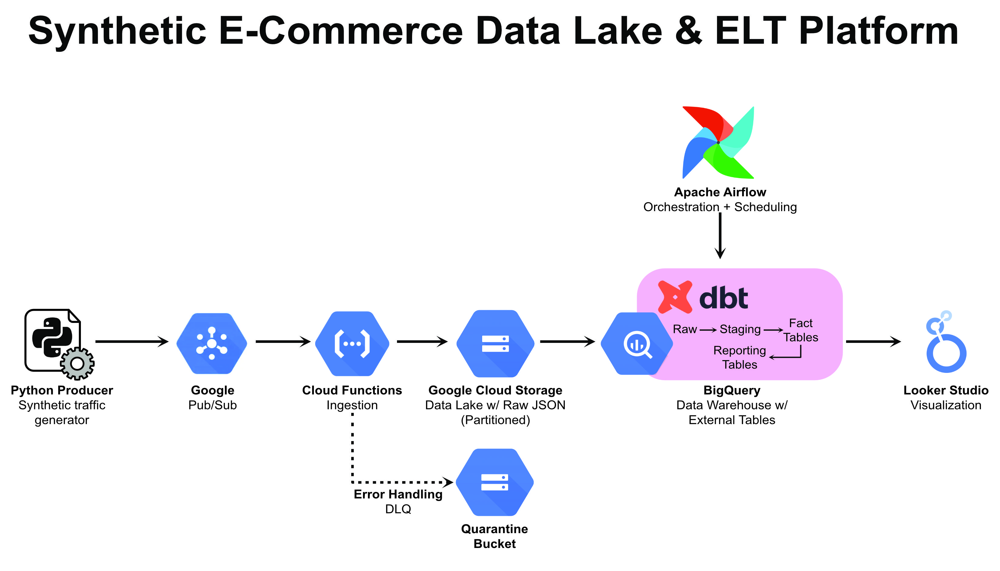

# Synthetic E-Commerce Data Lake & ELT Platform

A complete end-to-end data engineering platform that generates synthetic e-commerce traffic, ingests it into a serverless Data Lake, and performs daily ELT transformations using Modern Data Stack tools.

## 📋 Table of Contents

1. [Architecture](https://www.google.com/search?q=%23-architecture)
2. [Tech Stack](https://www.google.com/search?q=%23-tech-stack)
3. [Getting Started](https://www.google.com/search?q=%23-getting-started)
    - [Prerequisites](https://www.google.com/search?q=%23prerequisites)
    - [Infrastructure Setup](https://www.google.com/search?q=%232-infrastructure-setup-terraform)
    - [Deployment](https://www.google.com/search?q=%233-deploy-ingestion-function)
4. [Running the Pipeline](https://www.google.com/search?q=%23-running-the-pipeline)
    - [Data Generation](https://www.google.com/search?q=%23step-1-start-the-data-generator)
    - [Transformation (dbt)](https://www.google.com/search?q=%23step-2-configure-dbt-transformation)
    - [Orchestration (Airflow)](https://www.google.com/search?q=%23step-3-start-airflow-orchestration)
5. [Testing & Quality Assurance](https://www.google.com/search?q=%23-testing--quality-assurance)
6. [Cleanup](https://www.google.com/search?q=%23-cleanup)
7. [Project Structure](https://www.google.com/search?q=%23-project-structure)

## 🏗 Architecture

The platform follows a modern **ELT (Extract, Load, Transform)** pattern, decoupled into three stages: Ingestion, Storage, and Transformation.

**High-Level Data Flow:**
`Python Producer` ➔ `Google Pub/Sub` ➔ `Cloud Functions` ➔ `GCS (Data Lake)` ➔ `BigQuery` ➔ `dbt` ➔ `Looker Studio`



### Component Breakdown

| Stage | Component | Description |
| --- | --- | --- |
| **Source** | **Python Producer** | Acts as the "user traffic" simulator. It generates realistic fake JSON events (order completed, page viewed, ad clicked, etc) and publishes them to the topic. It also intentionally introduces "poison pill" (malformed) records 1% of the time to test system resilience. |
| **Buffer** | **Google Pub/Sub** | Serves as the ingestion buffer. It decouples the high-speed producer from the downstream consumers, allowing the system to handle traffic spikes without crashing. |
| **Ingestion** | **Cloud Functions (Gen 2)** | A serverless Python function triggered by every message in Pub/Sub. It parses the JSON, validates the schema, and routes the data. Valid data goes to the Data Lake; invalid data goes to the Dead Letter Queue. |
| **Storage** | **Google Cloud Storage (GCS)** | The **Raw Data Lake**. A single bucket (`ecommerce-lake`) stores JSON files as immutable objects, organized by Hive-style partitioning: `event_type=X/year=YYYY/month=MM/day=DD`. |
| **Resilience** | **Quarantine Bucket (DLQ)** | The **Dead Letter Queue**. If the Ingestion function fails to parse a record (e.g., missing timestamp), it saves the raw payload here for manual inspection instead of crashing the pipeline. |
| **Warehouse** | **BigQuery** | The serverless Data Warehouse. It sits on top of GCS and treats the raw JSON files as **External Tables**, allowing the querying of files using standard SQL without moving data. |
| **Transform** | **dbt (Data Build Tool)** | The transformation engine. It executes SQL jobs inside BigQuery to convert raw data into polished **Fact**, **Dimension**, and **Reporting** tables. It handles testing, documentation, and lineage. |
| **Orchestrate** | **Apache Airflow** | The workflow manager. It runs on a daily schedule to trigger the dbt models (Staging ➔ Marts ➔ Reports), ensuring that business reports are updated only after fresh data has arrived and passed tests. |
| **Visualize** | **Looker Studio** | (Optional) Connects to the final BigQuery Fact tables to visualize metrics like "Daily Revenue" and "Top Selling Products". |

## 🛠 Tech Stack

* **Language:** Python 3.12
* **Cloud:** Google Cloud Platform (GCP)
* **Infrastructure:** Terraform
* **Transformation:** dbt Core
* **Orchestration:** Apache Airflow
* **Package Manager:** uv

## 🚀 Getting Started

### Prerequisites

* [Google Cloud SDK (gcloud)](https://cloud.google.com/sdk/docs/install) installed and authenticated.
* [Terraform](https://developer.hashicorp.com/terraform/install) installed.
* [uv](https://github.com/astral-sh/uv) installed (Fast Python package manager).

### 1. Clone the Repository

```bash
git clone https://github.com/RutvikNK/Synthetic_E-Commerce_Data_Lake.git
cd synthetic-ecommerce-lake

```

### 2. Infrastructure Setup (Terraform)

Provision the GCP resources (Bucket, Pub/Sub Topic, BigQuery Dataset).

```bash
cd infra
# Initialize Terraform
terraform init

# Apply configuration (Type 'yes' to confirm)
terraform apply

```

**Important:** Note the `bucket_name` and `quarantine_bucket` from the Terraform output. You will need them for the next step.

### 3. Deploy Ingestion Function

Deploy the serverless function that moves data from Pub/Sub to GCS.

```bash
# Ensure you are in the root directory (go back up from infra/)
cd ..

# Export variables (Replace with your actual bucket names)
export NEW_BUCKET=$(cd infra && terraform output -raw bucket_name)
export QUARANTINE=$(cd infra && terraform output -raw quarantine_bucket)

gcloud functions deploy ingest-ecommerce-events \
    --gen2 \
    --runtime=python312 \
    --region=us-central1 \
    --source=./src/ingestion \
    --entry-point=ingest_event \
    --trigger-topic=ecommerce-events \
    --set-env-vars=BUCKET_NAME=$NEW_BUCKET,QUARANTINE_BUCKET=$QUARANTINE

```

## 🏃‍♂️ Running the Pipeline

### Step 1: Start the Data Generator

This script simulates user traffic (purchases, page views) and sends it to Pub/Sub.

```bash
# Install dependencies
uv sync

# Run the producer
uv run src/generator/producer.py

```

*Leave this terminal open. Data is now flowing.*

### Step 2: Configure dbt (Transformation)

Set up dbt to talk to your BigQuery dataset.

```bash
# Change to transformation directory
cd transformation

# Install dependencies
uv run dbt deps

# Run seeds to initialize static data (if any)
uv run dbt seed

# Build the project (Staging + Marts + Reports)
uv run dbt run

```

### Step 3: Start Airflow (Orchestration)

Launch the Airflow Scheduler and Webserver to automate the daily runs.

```bash
# Set Airflow Home to the orchestration directory
export AIRFLOW_HOME=$(pwd)/orchestration

# Initialize the database and create user (First time only)
uv run airflow db migrate
uv run airflow users create \
    --username admin \
    --firstname Peter \
    --lastname Parker \
    --role Admin \
    --email admin@example.com \
    --password admin

# Start Airflow Scheduler
uv run airflow scheduler

# (In a new terminal) Start Airflow Webserver
uv run airflow webserver --port 8080

```

* **Login:** Open `http://localhost:8080`.
* **Credentials:** `admin` / `admin`.
* **Action:** Unpause the `ecommerce_analytics_pipeline` DAG to start the pipeline.

## 🧪 Testing & Quality Assurance

The project includes a suite of unit tests for the generator and ingestion logic, as well as resilience tests for the Dead Letter Queue.

```bash
# Run the test suite
uv run pytest

```

### Chaos Engineering (Simulate Errors)

The producer script intentionally sends "poison pill" (malformed) data 1% of the time.

1. Check the **Quarantine Bucket** in Google Cloud Console (`gs://YOUR_BUCKET-quarantine/failed/`).
2. You should see files appearing there. This proves the pipeline is resilient and does not crash on bad data.

## 🧹 Cleanup

To avoid incurring cloud costs, destroy the infrastructure when finished.

```bash
cd infra
terraform destroy

```

## 📂 Project Structure

```text
├── infra/                  # Terraform Infrastructure as Code
├── orchestration/          # Airflow DAGs and Config
│   ├── dags/               # Pipeline definitions (Python)
├── src/
│   ├── generator/          # Python Data Producer (Fake traffic)
│   └── ingestion/          # Cloud Function source code
├── transformation/         # dbt Project (SQL Models)
│   ├── models/             
│   │   ├── staging/        # 1:1 Views of raw data
│   │   ├── marts/          # Fact & Dimension tables
│   │   └── reporting/      # Final business logic tables
│   └── seeds/              # Static data
├── tests/                  # Pytest Unit Tests
└── pyproject.toml          # Python Dependencies

```